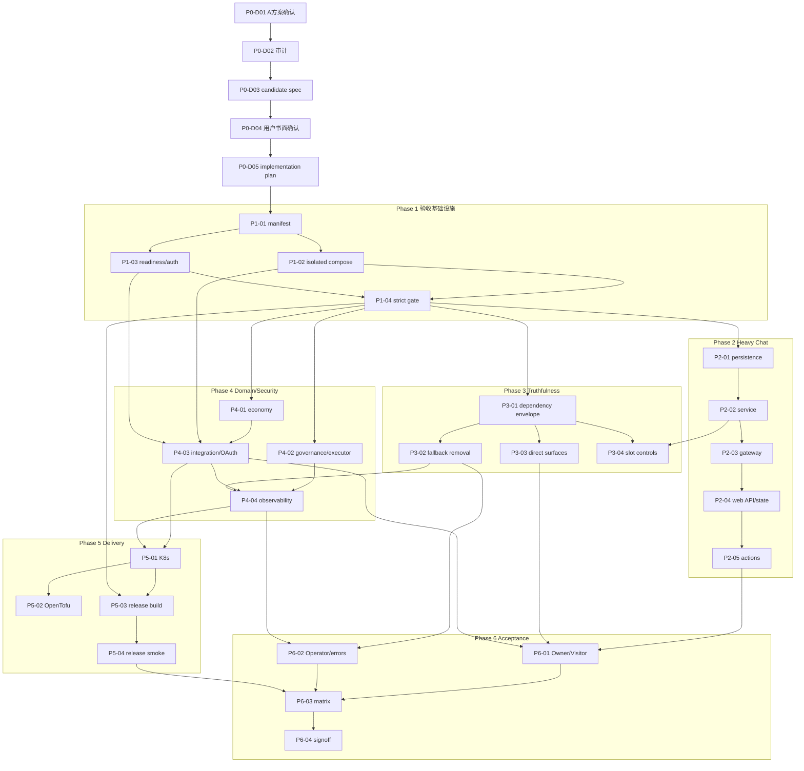

# Platform 产品完成依赖图

```mermaid
flowchart TD
  D01[P0-D01 A方案确认] --> D02[P0-D02 审计]
  D02 --> D03[P0-D03 candidate spec]
  D03 --> D04[P0-D04 用户书面确认]
  D04 --> D05[P0-D05 implementation plan]

  subgraph P1[Phase 1 验收基础设施]
    P101[P1-01 manifest] --> P102[P1-02 isolated compose]
    P101 --> P103[P1-03 readiness/auth]
    P102 --> P104[P1-04 strict gate]
    P103 --> P104
  end
  D05 --> P101

  subgraph P2[Phase 2 Heavy Chat]
    P201[P2-01 persistence] --> P202[P2-02 service]
    P202 --> P203[P2-03 gateway]
    P203 --> P204[P2-04 web API/state]
    P204 --> P205[P2-05 actions]
  end
  P104 --> P201

  subgraph P3[Phase 3 Truthfulness]
    P301[P3-01 dependency envelope] --> P302[P3-02 fallback removal]
    P301 --> P303[P3-03 direct surfaces]
    P202 --> P304[P3-04 slot controls]
    P301 --> P304
  end
  P104 --> P301

  subgraph P4[Phase 4 Domain/Security]
    P401[P4-01 economy] --> P403[P4-03 integration/OAuth]
    P402[P4-02 governance/executor] --> P404[P4-04 observability]
    P403 --> P404
  end
  P104 --> P401
  P104 --> P402
  P102 --> P403
  P103 --> P403
  P302 --> P404

  subgraph P5[Phase 5 Delivery]
    P501[P5-01 K8s] --> P502[P5-02 OpenTofu]
    P501 --> P503[P5-03 release build]
    P104 --> P503
    P503 --> P504[P5-04 release smoke]
  end
  P403 --> P501
  P404 --> P501

  subgraph P6[Phase 6 Acceptance]
    P601[P6-01 Owner/Visitor] --> P603[P6-03 matrix]
    P602[P6-02 Operator/errors] --> P603
    P504 --> P603
    P603 --> P604[P6-04 signoff]
  end
  P205 --> P601
  P303 --> P601
  P403 --> P601
  P302 --> P602
  P404 --> P602
```
